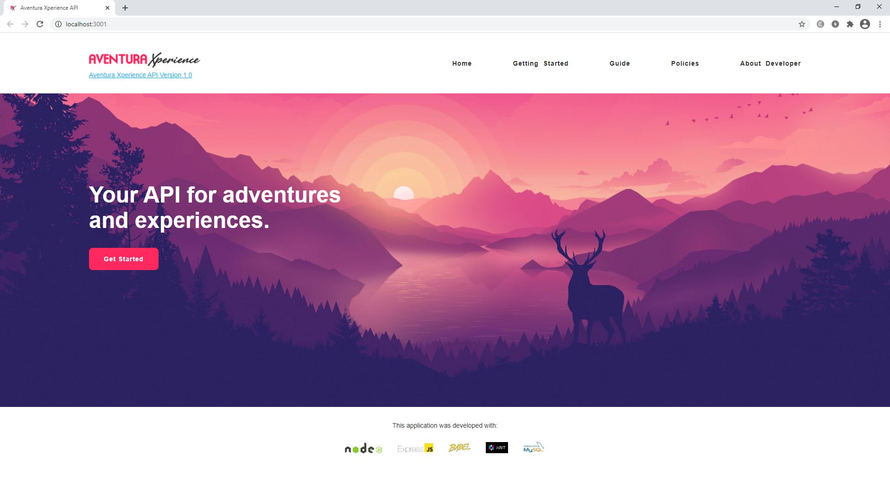

# Aventura Xperience API v.2.7.10.

### Screenshot home:

## Used stacks:

-  Node JS with Express JS framework
-  Javascript ECMAScript 6
-  Babel JS
-  JSON Web Token ( JWT ).

## Micro-services oriented architecture
- 
